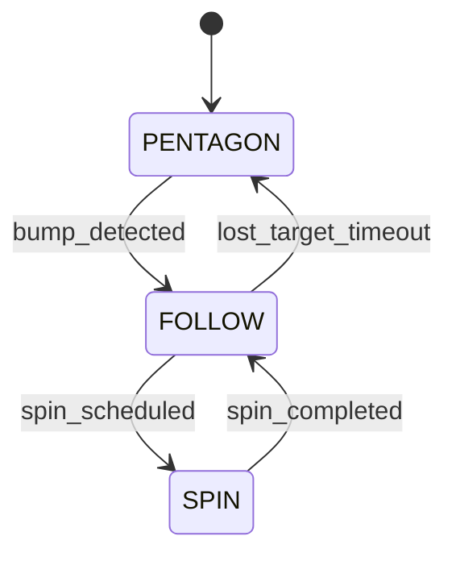

# RoboBehaviors-and-Finite-State-Machines-Project

**ENGR3590: Computation Introduction to Robotics &nbsp;|&nbsp; Fall 2025**  
**Akshat Jain &nbsp;|&nbsp; Satchel Schiavo &nbsp;|&nbsp; Owen Himsworth**

---

## Overview

Our goal was to design and implement a ROS 2 (Humble) robotics Finite State
Machine (FSM) for the Neato robot. We combined three behaviors: driving a
pentagon, spinning 360°, and following people—into this FSM. The FSM supervises
these behaviors, switching between them based on sensor input and timed events.
The project demonstrates successful integration of time-based and reactive
control strategies, with all code running on both simulated and physical Neato
robots.

## Project Prompt
Your goal in this project will be to program the Neato to execute a number of
behaviors (e.g., teleop, driving a trajectory of a pre-defined shape,
wall-following, people-following, and obstacle avoidance) within a finite-state
machine.

## Behaviors

### 360

- **Problem:**
    The 360 spin is the simplest of all the behaviors in this project, only requiring an angular velocity change. We set a rotational speed and track how many full rotations the Neato has gone through, before reporting the total amount of spins. 

- **Approach:**
We provided a basic angular velocity through:
```python 
angular_vel_rps: float = 0.5, clockwise: bool = False):
        """
        Args:
            angular_vel_rps: Magnitude of angular speed.
            clockwise: If True, spins clockwise (negative z); else CCW.
```
and calculated the total time t that the Neato would spin in:
```Python
"""Publish a constant angular velocity for the required duration, once."""
        # Some setups drop the first message; send a zero first.
        self.drive(0.0, 0.0)
        sleep(1.0)


        total_angle_rad = 2.0 * math.pi
        duration_s = total_angle_rad / abs(self.angular_vel)
```
We then have the Neato constantly spin a full rotation at angular_vel, before reporting it’s completed a full loop and restarting. 

### Drive Pentagram

- **Problem:**
Building on our first behavior of a purely rotational movement, the next step was to create a static path that incorporated both rotational and linear travel. We settled on a pentagon shape because it seemed like a non-trivial improvement over the default square trajectory. The main motivation for a static path was to have a basic movement pattern and allowed us to experiment with angle velocities for turning and linear velocities for moving distances. 
- **Approach:**
At a high level, our pentagon script has the NEATO move forward for a set distance at a set linear velocity, rotate 72 degrees at a set rotational speed, and then repeat an additional four times. We initially struggled to effectively control the NEATOs without a relative position, until we decided to reference the NEATOs speed and total time in order to derive the travel distance. This also allowed us to create a different sized pentagon by changing the edge_length_m while keeping forward_vel and angular_vel constant. n\

    We first define edge_length_m, which is the length of one side of the pentagon, and external_turn_rad, which is 72 degrees in radians - ⅕ of a complete 360 degree circle. We then used for side in range(5) to have the Neatos loop a total of five times before we drive forward for a time t determined by:
    ```Python
    t = abs(distance_m) / self.forward_vel if self.forward_vel > 0 else 0.0
    ```
    Then moving for time t before turning left by a time t fixed by:
    ```Python
    t = abs(angle_rad) / self.angular_vel if self.angular_vel > 0 else 0.0
    ``` 
    Which again followed by time t.


- **Diagram/GIF:**

    

### People Follower

- **Problem:**
Both our pentagon and 360 spin behaviors were operated independently of the environment our Neato was in, and as such were limited in their scope. We built on our angular and linear velocity control to create a control loop that allow our Neato to follow a moving box around an environment.

- **Approach:**
Our solution for a person follower was twofold - first we used a LiDAR scan to locate the nearest object, derive coordinates from it, and then set up a control loop to move our Neato ito a set distance from the object.
All Neatos come equipped with a LiDAR scanner, which we used to scan the area about our neato and return the closest point’s distance and angle. We then set our own Neato’s position and find the distance between the two points, using it as a speed modifier. This makes Neato's linear velocity proportional to the distance between it and the object, which acts as a basic control loop.
Similarly, we take the difference between the polar coordinate of the object and the origin (aka Neato) and correct the angular velocity as well. This behavior was trickier to tune, as we ended up overshooting our closest object and would cause Neato to latch onto different objects entirely. Through trial and error and we ended up using control values of 0.01 proportional angular gain to help Neato center.

### Finite State Controller

- **Problem:**
- **Approach:**

#### State Diagram



#### Operation on Physcial Neato
[▶️ Watch demo on YouTube](https://www.youtube.com/watch?v=IAnVcPswp0I)

#### Operation in Gazebo
[▶️ Watch demo on YouTube](https://youtu.be/Z0-pUuza7xg)

## Challenges

## Takeaways
- **Owen:**
- **Satchel:**
- **Akshat**

## Code Structure

- Package tree
- Key nodes & responsibilities
- Parameters (`config/params.yaml`)
- Launch files

## Debugging & Tools

- RViz config
- Rosbag workflow
- Takeaways (3–6 bullets, each w/ one-sentence elaboration)

## Build & Run

```bash
# Build
colcon build --packages-select ros_behaviors_fsm
source install/setup.bash

# Run FSM (with params & RViz)
ros2 run ros_behaviors_fsm finite_state_controller

# View FSM state topic (live state)
ros2 topic echo /fsm/state
```
